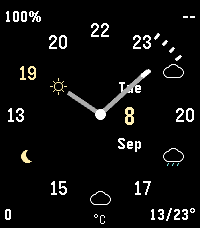
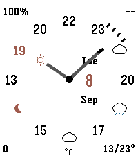

# Crisp Weather

An analog Pebble watchface with an hourly weather forecast around the dial.
Based on [Michal Bláha’s Crisp](https://github.com/michalblaha/Crisp-watchface), it keeps the two-tone hands, themes, date, and configurable corner readouts.




*Emulator previews with illustrative weather data.*

## Features

- Read the forecast clockwise from the current hour, covering up to the next 11 hours.
  Some trailing positions remain hour ticks for readability.
- See the current hour’s temperature on the dial and its weather icon at the hour-hand tip.
  Future hours show an icon when conditions change, otherwise a temperature.
- Customize themes, forecast colors on color watches, corner readouts, temperature units, and Bluetooth disconnect alerts.
- Get weather from [Open-Meteo](https://open-meteo.com/) through your phone every 30 minutes, with no API key.
  Phone location permission and internet access are required.

Weather is an hourly forecast, not a live observation.
The watchface shows the original Crisp dial until weather arrives, and returns to it after three hours without a fresh forecast.

Targets: aplite, basalt, chalk, diorite, emery, flint, and gabbro.
Crisp Weather can be installed alongside the original Crisp.

This is an early version.
Phone location and live weather delivery have not yet been tested on physical hardware.

## Build and develop

Install Node.js, npm, and the [Pebble SDK](https://developer.repebble.com/sdk/), then run:

```sh
npm install
npm test
pebble build
pebble install --emulator emery
```

The watchface bundle is written to `build/pebble-face.pbw`.

- `src/c/`: watchface rendering, settings, and forecast cache.
- `src/pkjs/`: phone-side weather requests, forecast parsing, and settings UI.
- `tests/`: JavaScript tests and native C tests.

Run the native forecast cache test with a C compiler:

```sh
cc -Itests/native -o /tmp/crisp-forecast-test tests/native/forecast_test.c src/c/forecast.c
/tmp/crisp-forecast-test
```

For a reproducible emulator preview, run `python scripts/preview.py emery dark` (or `light`) in the Python environment containing `pebble-tool`.
The script sets the emulator clock and supplies fixture weather data.

See [UPSTREAM.md](UPSTREAM.md) for source attribution and the imported revision.
